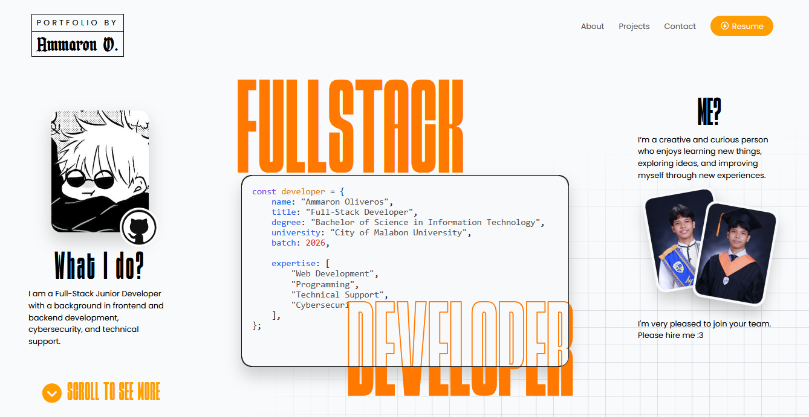

# Ammaron O. Portfolio


Personal portfolio website for Ammaron Oliveros, a creative full-stack junior developer with a strong mix of design thinking and code.
[View live demo](https://portfolio-oliveros.vercel.app/)

## Features

- Responsive portfolio landing page
- About section with profile, technical stack, and learning goals
- Project cards rendered dynamically from JavaScript data
- Scroll reveal and hero motion effects
- Contact section with email and social links

## Project Structure

```text
.
├── index.html              # Main portfolio page
├── scripts/
│   ├── index.js            # Page behavior and project rendering
│   └── projects.js         # Project information
├── style/
│   ├── global.css          # Shared styles
│   ├── index.css           # Portfolio page styles
│   └── font.css            # Local font definitions
├── img/                    # Portfolio images
└── fonts/                  # Local font files
```

## Updating Projects

Project content is stored in [`scripts/projects.js`](scripts/projects.js). Add or update objects in the exported `projects` array:

```js
{
	image: 'img/project-image.jpg',
	imageAlt: 'Accessible description of the project image',
	category: 'Category • Type',
	title: 'Project title',
	description: 'Short project description.',
	tags: ['HTML', 'CSS', 'JS'],
}
```

The cards are generated automatically by [`scripts/index.js`](scripts/index.js).

## Built With

- HTML5
- CSS3
- JavaScript ES modules
- Font Awesome
- Devicon
